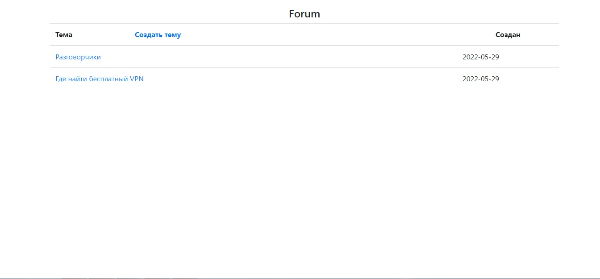
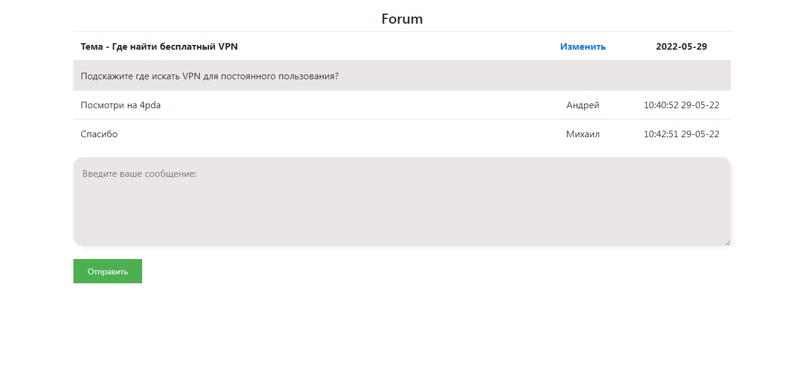

Описание:
Площадка для обсуждения тем. Есть возможность создавать пользователей, создавать темы, редактировать темы, оставлять сообщения.
Для входа на форум необходимо зарегистрироваться.

Используемые технологии:
1. Java 16
2. Spring Boot 2
3. Spring Security & JWT authorization
4. Spring Data JPA
5. PostgreSQL
6. Liquibase
7. JSP (JavaServer Pages)
8. JSTL (JSP Standard Tag Library)
9. HTML
10. CS